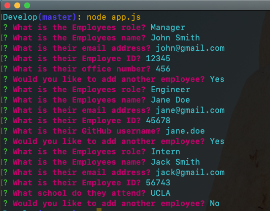
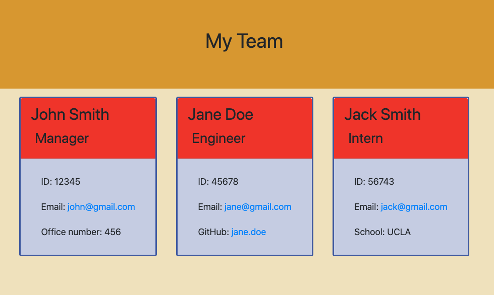

# Team-Generator Description
A command line application that generates an HTML formatted team roster based off user input. Built in jest testing ensures functionality of classes and sub-classes.

## Links

* [Video of Application in Action](https://drive.google.com/file/d/1pfCjzlIWOPkIIdZK3SzmroUWXVqK9u25/view)

## Application in Action
* Command line interface using Inquirer to prompt the user for information about their team. 

* Finished product, auto-generated with templated HTML.

* The application in action from the CLI to VS Code to the web browser.

## Technologies Used
* Javascript
* CSS and HTML
* Bootstrap
* Node.js
* Node modules: Inquirer, path, fs, Jest

## Usage

* Once in the Develop directory, run 'node app.js' in your CLI.

## Questions

If you have any questions about the project, contact me at grantnsmith@gmail.com
